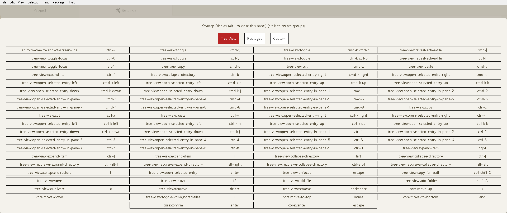

# keymap-display package

Displays custom keymaps with a nice interface.
Also allows you to search for keyboard shortcuts.

1. Press `alt-j` to toggle the keymap display (shown/hidden).

2. Press `alt-k` when the keymap display is shown to search
for a keyboard shortcut.

3. Press `alt-l` to switch between groups of keyboard shortcuts.
Alternatively, click on the group buttons to switch between
groups of keyboard shortcuts.
